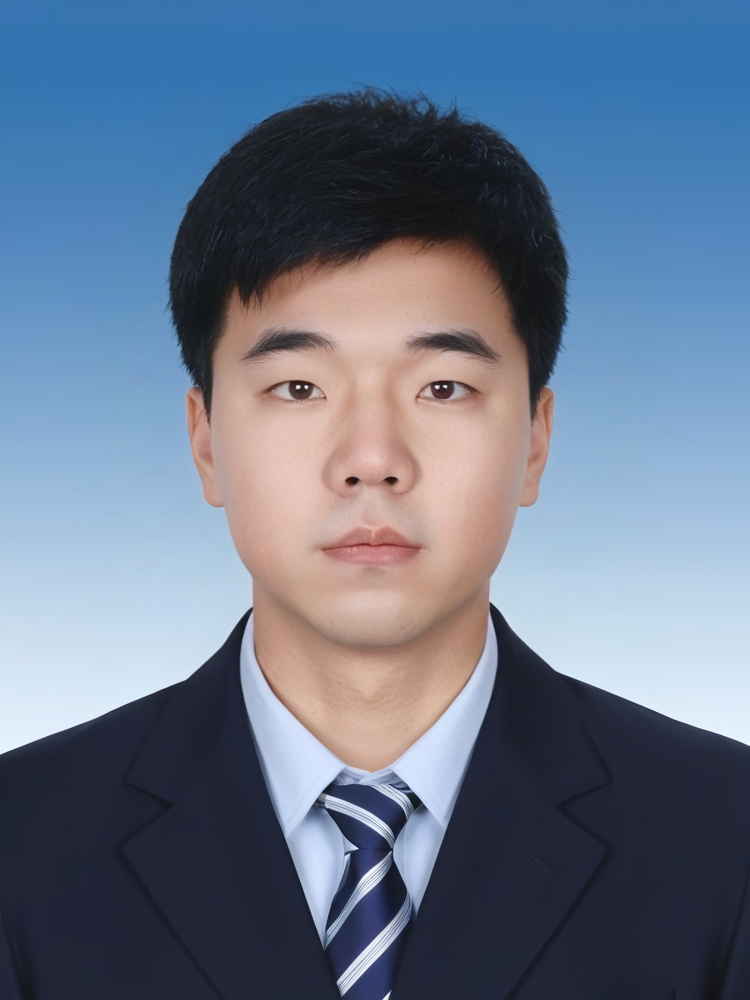

# Sergio Termann

[English | [Deutsch](./README_DE.md)]

## Contact Information
- **Phone:** +86-13011010011
- **Email:** shuaihao@buaa.edu.cn
- **Location:** Haidian District, Beijing
- **Position:** PhD Student in Automation, Beihang University (Class of 2022)

## Photos
<!-- Add your photos here -->

*Add your profile photo above*

*Add project-related photos here*

---

## Education Background

### Beihang University (BUAA) | September 2019 - December 2021
- **Degree:** Master of Engineering
- **Major:** Software Engineering
- **Achievements:**
  - Outstanding graduate student in Beijing in 2020
  - Outstanding graduate of Beijing
  - Part-time instructor for full-time master's students in 2019

### Beijing University of Technology | September 2014 - June 2018
- **Degree:** Bachelor of Engineering
- **Major:** Measurement and Control Technology and Instruments
- **Achievements:**
  - Outstanding graduate thesis, school-level science and technology competition first prize, second prize, and multiple awards
  - Former president of the Optical Society student branch, former director of the Beijing University of Technology Club Department
  - Member of the Beijing University of Technology Aviation Team

---

## Internship and Project Experience

### Beihang Software Institute Autonomous Driving Project Team & Zhongguancun AI Innovation and Entrepreneurship Base
**Duration:** June 2019 - September 2019

#### Unmanned Vehicle Teaching Platform Integration and Control Code Implementation
- Implemented real-time communication and control mechanism integration using STM32 microcontroller
- Achieved control signal output and prediction for Apollo platform, ensuring platform stability during testing and reducing accidents through the use of launch tube management

### Chinese Academy of Sciences Institute of Automation - Zhao Dongbin Team
**Duration:** March 2020 - March 2022

#### International Competition AI Micromanipulation Confrontation
- Implemented parallel sampling construction using multiprocessing and zeromq microservices, significantly improving sampling efficiency

#### Robomaster AI Competition Simulation
- Implemented our team's unmanned comprehensive map navigation. In the Robomaster AI competition, the automated team achieved comprehensive simulation of all three competition venues nationwide

### National Key R&D Program '2030' Major Project
**Duration:** March 2020 - March 2022

#### High-Performance Reinforcement Learning Decision-Making Under Complex Environments for Anti-Network Countermeasures - Beijing Section
- Built combat environment based on harfang dogfight air combat, designed human-machine experience collection programs and multi-machine combat scenarios, completed program development and open-sourced it

### Aerospace Intelligent Courtyard Body Intelligence Project
**Duration:** April 2024 - October 2024

#### Large-Scale Parallel Reinforcement Learning Chemical Training Environment Construction and Optimization Based on IsaacSim
- Designed large-scale parallel robot groups, implemented multi-robot group training in various simulation environments, achieving large-scale GPU cluster parallel optimization of reinforcement learning algorithms

#### Multi-Modal Large Model Parallel Robot Decision-Making and Training
- Implemented large-scale language model decision-making prediction based on multi-modal large model simulation learning, large-scale robot parallel deployment

---

## Competition Experience

### 2020 NIPS Aicrowd Procgen Reinforcement Learning Challenge
**Duration:** July 2020 - November 2020
- **Achievement:** Completed multiple reinforcement learning algorithms, achieving Ray and RLlib-based code framework implementation and optimization, defining new wrapper implementation and multiple data augmentation methods. The team achieved global top ten results, first place globally, and third place globally in the top six rankings

### 2023 Air Force "Unmanned Swarm" Challenge Competition Excellence Award 2V2
**Duration:** July 2023 - August 2023
- **Achievement:** Completed algorithm optimization and simulation

---

## Research Publications

Published multiple papers in **IEEE Transactions on Cognitive and Developmental Systems (SCI Q1)**, **Aerospace Science and Technology (SCI Q1)**, **Guidance, Navigation and Control (ESCI)** and other journals, as well as presentations at **International Conference on Intelligent Control and Information Processing** and other conferences.

---

## Professional Skills and Others

### Technical Skills
- **Programming Languages & Tools:** Proficient in Dify, Ollama and other large model tools, familiar with IsaacSim and other embodied intelligence platforms, with strong practical experience in artificial intelligence applications in robotics
- **Reading & Research:** Extensive reading habits, read over 200 academic papers and books, physically strong with over 2000 hours of table tennis training experience

### Interests
- Artificial Intelligence and Robotics
- Reinforcement Learning and Multi-Agent Systems
- Autonomous Systems and Control
- Academic Research and Innovation

---

*This README provides an overview of Sergio Termann's academic and professional background. For more detailed information, please contact via the provided email address.*