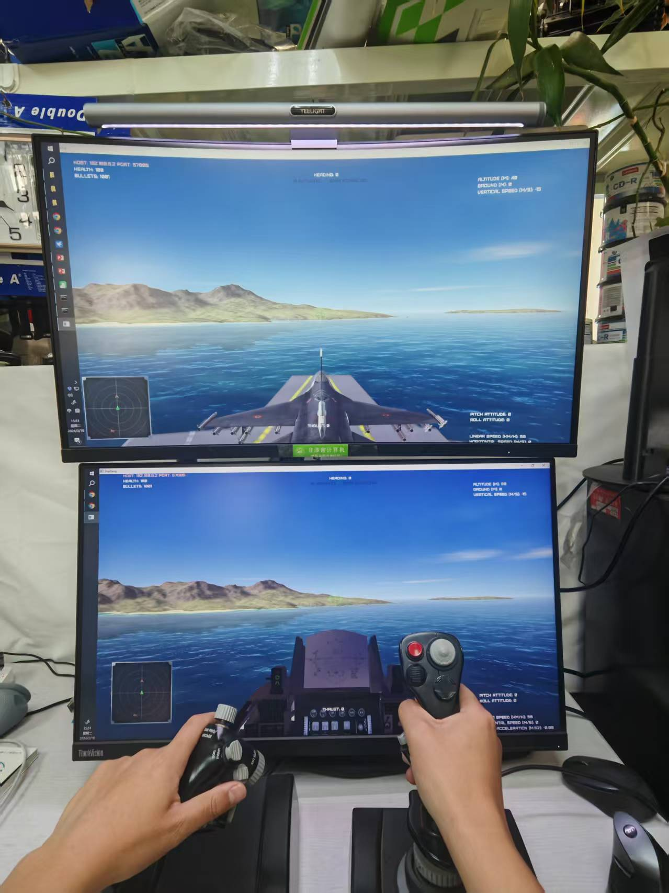

  
  <h1>Sergio Termann (Shuai Hao)</h1>
  
<strong>LLM-Agenten & Reinforcement Learning · AI-Leiter · Doktorand an der Beihang-Universität</strong>

  

    <a href="mailto:shuaihao@buaa.edu.cn">E-Mail</a> ·
    Peking, China ·
    <a href="./README.md">English</a>
  

## Über mich

Ich bin Doktorand im Bereich Automatisierung an der Beihang-Universität und arbeite an der Schnittstelle von **LLM-Agenten**, **Multi-Agenten-Reinforcement-Learning** und **Embodied Intelligence**. Als Mitgründer und AI-Leiter eines jungen Technologieunternehmens verantworte ich die KI-Roadmap von der Architektur und dem Modelltraining bis zur Bereitstellung und Projektauslieferung.

Meine aktuelle Arbeit konzentriert sich auf produktionsreife Agentensysteme mit **Planner-Executor-Workflows, hybridem RAG, Wissensgraphen, SFT, Function Calling und Feedbackschleifen**. Darüber hinaus verfüge ich über praktische Erfahrung mit Isaac Sim, verteiltem Reinforcement Learning, GPU-Clustern und lokaler LLM-Bereitstellung.

## Fotos

<table>
  <tr>
    <td align="center">
       
      Profilfoto
    </td>
    <td align="center">
       
      Persönliches Foto 1
    </td>
    <td align="center">
       
      Persönliches Foto 2
    </td>
  </tr>
</table>

## Aktuelle Schwerpunkte

- Entwicklung zuverlässiger Shopping-Agenten mit Planung, Retrieval, Werkzeugnutzung und kontinuierlicher Optimierung
- Training und Evaluation von Multi-Agenten-Strategien in großskaligen Simulationsumgebungen
- Verbesserung von Vielfalt und Zuverlässigkeit bei multimodaler Generierung und ausführlicher Bildbeschreibung

## Ausgewählte Berufserfahrung

### Beijing Fengqi Shiyu Technology Co., Ltd. · Mitgründer & AI-Leiter

**Intelligenter Shopping-Agent**

- Verantwortung für KI-Strategie, Systemarchitektur, Modelltraining und Projektauslieferung
- Entwicklung einer Planner-Executor-Pipeline mit hybridem RAG, Produktwissensgraph, Function Calling und Nutzerfeedback
- Aufbau von Workflows zur SFT-Datenerzeugung und Qualitätssicherung sowie lokale Modellbereitstellung
- Beitrag zur kommerziellen Validierung und zu einem Investment durch Tsinghua Lihe bei einer Bewertung von rund 40 Millionen RMB

### Aerospace Science and Industry Intelligent Research Institute · Forschungspraktikant

**Multi-Agenten-Reinforcement-Learning mit Isaac Sim · Apr. 2024 - Okt. 2024**

- Aufbau paralleler Simulationsumgebungen für UAV- und Quadruped-Roboterteams
- Anpassung von Umgebungen, Algorithmen und Trainingspipelines für GPU-Cluster
- Entwicklung wiederverwendbarer Abläufe für großskaliges RL-Training und Evaluation

### Nationales Großprojekt „Wissenschafts- und Technologieinnovation 2030“

**Entscheidungsfindung in hochdynamischen adversarialen Umgebungen · März 2020 - März 2022**

- Entwicklung von Werkzeugen zur Erfassung von Expertendemonstrationen mit Harfang3D Dogfight
- Aufbau von Mehrflugzeug-Kampfszenarien und reproduzierbaren Pipelines für Training und Benchmark-Evaluation

### Institut für Automatisierung, Chinesische Akademie der Wissenschaften · Gruppe Zhao Dongbin

**StarCraft-KI-Mikromanagement & RoboMaster-Navigation · März 2020 - März 2022**

- Entwicklung eines parallelen RL-Samplingsystems mit Python Multiprocessing und ZeroMQ
- Implementierung einer kollisionsfreien Navigation über die gesamte Karte für RoboMaster-Roboter; der Ansatz wurde von späteren Teams wiederverwendet, die in drei nationalen Disziplinen erste Preise gewannen

## Forschung & Wettbewerbe

- **ICML 2026, Zweitautor** — *Escaping the Likelihood Trap: Geometric Diversity Optimization for Long-Form Image Captioning*
- Publikationen in **IEEE Transactions on Cognitive and Developmental Systems**, **Aerospace Science and Technology**, **Guidance, Navigation and Control** sowie bei **ICICIP**
- **NeurIPS 2020 AIcrowd Procgen Challenge** — weltweit Platz 10 im Warm-up, Platz 7 in Runde 1 und Top 16 in Runde 2
- **Air Force Unmanned Swarm Challenge 2023, 2v2** — Excellence Award

## Technisches Profil

| Bereich | Technologien |
| --- | --- |
| LLM-Agenten | Planner-Executor, hybrides RAG, SFT, Function Calling, Wissensgraphen |
| Reinforcement Learning | Multi-Agenten-RL, Imitation Learning, adversariale Entscheidungsfindung, Ray, RLlib |
| Engineering & Simulation | Python, ZeroMQ, Isaac Sim, GPU-Cluster |
| Anwendungen & Bereitstellung | Dify, Xinference, Ollama, lokale LLM-Bereitstellung |

## Ausbildung

- **Promotion in Automatisierung**, Beihang-Universität, 2022 - heute
- **MEng in Software Engineering**, Beihang-Universität, 2019 - 2021  
  Ausgezeichneter Absolvent der Beihang-Universität · Ausgezeichneter Absolvent der Stadt Peking
- **BEng in Mess- und Regelungstechnik**, Beijing Institute of Technology, 2014 - 2018  
  Ausgezeichnete Bachelorarbeit · Erster und zweiter Preis bei universitären Wissenschafts- und Technologiewettbewerben

---

  <a href="mailto:shuaihao@buaa.edu.cn">shuaihao@buaa.edu.cn</a>

