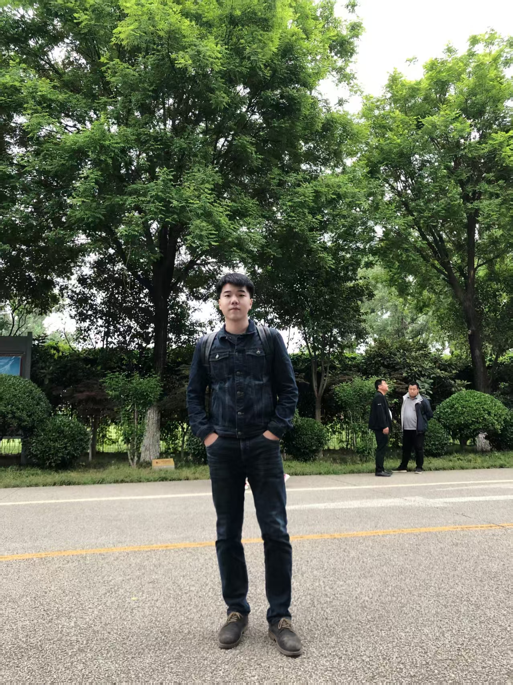

  <h1>郝帅（Sergio Termann）</h1>
  
<strong>大模型 Agent · 多智能体强化学习 · 具身智能</strong>

  
合伙人 / AI 负责人 · 北京航空航天大学博士研究生

  

    <a href="mailto:shuaihao@buaa.edu.cn">邮箱</a> ·
    中国北京 ·
    <a href="./README.md">English</a> ·
    <a href="./README_DE.md">Deutsch</a>
  

  
  &nbsp;&nbsp;
  

## 个人简介

北京航空航天大学自动化学院博士研究生，长期从事**大模型 Agent、多智能体强化学习与具身智能**研发。作为初创科技公司的合伙人和 AI 负责人，负责从技术路线、系统架构、模型训练到工程部署与项目交付的完整流程。

近期工作聚焦于基于 Planner-Executor、混合 RAG、商品知识图谱、SFT、Function Calling 与反馈闭环的生产级 Agent 系统，同时具备 Isaac Sim、分布式强化学习、GPU 集群和大模型本地化部署经验。

## 核心亮点

- **AI 技术负责人：** 联合创办科技公司并主导智能导购 Agent 的架构与交付；项目助力公司获得清华力合投资，估值约 4000 万元
- **科研成果：** ICML 2026 论文第二作者，研究长文本图像描述的几何多样性优化
- **强化学习工程：** 基于 Isaac Sim 和 GPU 集群搭建可复用的多智能体仿真、训练与评测流程
- **竞赛成绩：** NeurIPS 2020 AIcrowd Procgen 挑战赛第一轮全球第 7；获 2023 空军“无人争锋”挑战赛优胜奖

## 技术能力

| 方向 | 方法与工具 |
| --- | --- |
| 大模型 Agent | Planner-Executor、混合 RAG、SFT、Function Calling、知识图谱 |
| 强化学习 | 多智能体强化学习、模仿学习、博弈决策、Ray、RLlib |
| 仿真与工程 | Python、ZeroMQ、Isaac Sim、分布式采样、GPU 集群 |
| 应用与部署 | Dify、Xinference、Ollama、大模型本地化部署 |

## 核心经历

### 北京风起时域科技有限公司 · 合伙人 / AI 负责人

**智能导购 Agent**

- 负责公司 AI 技术路线、系统架构、模型训练与项目交付
- 设计 Planner-Executor 主链路，融合混合 RAG、商品知识图谱、Function Calling 与用户反馈闭环
- 搭建 SFT 数据生成和质量门禁流程，完成大模型本地化部署

### 航天科工集团智能研究院 · 实习生

**基于 Isaac Sim 的多智能体强化学习 · 2024.04 - 2024.10**

- 搭建无人机、四足机器人集群等多智能体并行仿真环境
- 完成 GPU 集群部署及环境、算法和训练脚本适配
- 形成可复用的大规模强化学习训练与评测流程

### 科技部科技创新 2030 重大项目

**高智能强动态环境博弈决策子课题 · 2020.03 - 2022.03**

- 基于 Harfang3D Dogfight 开发人类专家经验采集工具
- 构建多机空战仿真场景，支撑算法训练、基线评测与实验复现

### 中国科学院自动化研究所 · 赵冬斌团队

**星际争霸 AI 微操作与 RoboMaster 导航 · 2020.03 - 2022.03**

- 基于 Python multiprocessing 和 ZeroMQ 搭建强化学习并行采样系统
- 实现 RoboMaster 装甲机器人无碰撞全图遍历；方案被后续团队复用，助力获得 3 个赛道全国一等奖

## 科研与荣誉

- **ICML 2026，第二作者**：*Escaping the Likelihood Trap: Geometric Diversity Optimization for Long-Form Image Captioning*
- 在 **IEEE Transactions on Cognitive and Developmental Systems**、**Aerospace Science and Technology**、**Guidance, Navigation and Control** 及 **ICICIP** 等期刊和会议发表多篇论文
- **NeurIPS 2020 AIcrowd Procgen 强化学习挑战赛**：热身赛全球第 10、第一轮第 7、第二轮 16 强
- **2023 空军“无人争锋”挑战赛 2V2 赛道**：优胜奖

## 教育背景

- **自动化博士研究生**，北京航空航天大学，2022 - 至今
- **软件工程硕士**，北京航空航天大学，2019 - 2021  
  北航优秀研究生 · 北京市优秀毕业生
- **测控技术与仪器学士**，北京理工大学，2014 - 2018  
  光电学院优秀毕业论文 · 校级科技竞赛一等奖、二等奖

  欢迎就大模型 Agent、强化学习与具身智能方向开展科研或工程合作。

